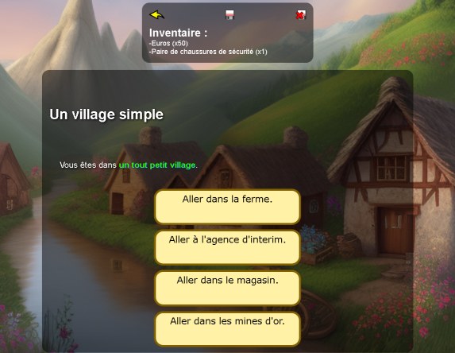

:toc:

A Javascript framework to easily write text adventures.

Have fun with it.

== FEATURES

* Inventory system.
* "Go back" button (adjusting the game state accordingly!).
* Load/save system.
* Auto-redirect to episodes (and can manage circular redirects).
* Safeguards (auto-detect duplicate episode names, detect paths that leads nowhere...)
* Vanilla Javascript.

== Demo
A sample game illustrating all the features.

On GitLab: https://marclv.gitlab.io/cyoajsengine/games/a_sample_game/index.htm

On GitHub: https://marl1.github.io/cyoajsengine/games/a_sample_game/index.htm

== Base Fonctions

*episode* : this is the base function to create an episode. An episode is a reusable "step" in the player's adventure. It's usually a location ("in front of the cave") or an event ("meeting with the king"). A game is usually composed of multiple episodes, inside of which there is text, links, scripts...

The structure is as follow:
[source,javascript]
----
episode({
    key: "uniqueIdentifierOfTheEpisode",
    title: () => `The title of this episode (for instance "Arrival in the village")`,
    text: () => `This is the description of this episode (location, player actions...).`
    ,links: [
            {label: () => `This is a link to another episode.`,
            path: "anotherEpisode"},
            {label: () => `This is a second link.`,
            path: "aThirdEpisode"}
        ]
    ,image: "imageFileName.png"
    ,revisit:"aFourthEpisode" // Episode to redirect to if we already have visited this episode
});
----

*setGameTitle* : give a title to the game. Will be used as a title in the web browser. Will also be used internally to distinguish saves between games.

=== Commands

Those are the functions that you can use in episodes, for instance to give player an item or to modify a variable.

*giveToPlayer* : `giveToPlayer({key:"uniqueIdOfTheObjectType", name:"name of the object", description:"description of the object that will be displayed in the inventory panel.", amount:99});`. Adds or removes (by using a negative number) an object to the player's inventory. The action of giving or taking will be highlighted in the inventory.

Exemple, giving player some money:
[source,javascript]
----
episode({
    key: "goToTheTempAgency",
    title: `Go to the temp agency.`,
    text:`You work and earn ***50 euros***.`
    ,commands: () => {
		    giveToPlayer({key:"euros", name:"Euros", description:"Some euros.", amount:50});
    }
});
----

*giveSilentlyToPlayer* : `giveSilentlyToPlayer({key:"uniqueIdOfTheObjectType", name:"name of the object", description:"description of the object that will be displayed in the inventory panel.", amount:99});`. Same as giveToPlayer but won't be highlighted in the inventory. Usueful when you want to give something discretely, for instance at the start of the adventure.

*addLink* : ``addLink({label: `Label of the link.`, path: "pathOfTheLink"});``. Adds a link. If it already exists, won't be added again.

*addText* : ``addText(`Nouveau texte !`);``. Adds a text to the end of the current episode or a specified episode.

*setVariable* : ``setVariable("nomDeMaVariable", 18);``. Assigns a value to a new variable or modifies an existing variable.

*getNumberOf* : `getNumberOf("pioche")`. Returns the number of the specified object the player possesses. Useful for setting conditions, for example, "if the player has at least 4 sticks, then...".

*getNumberOfVisits* : Returns the number of previous visits to the current episode.

*replaceAllLinks* : ``replaceAllLinks({label: `Nouveau lien.`, path: "cheminDuNouveauLien"});``. Removes all existing links in the episode and replaces them with new ones.

*remplaceAllText* : ``remplaceAllText(`Nouveau texte !`);``. Replaces all text in the current episode or a specified episode.

*showVariable* : ``showVariable("nomVariable")``. Returns a variable value.

*variable* : ``variable("nomVariable")`` ou ``variable("nomVariable", "nouvelleValeur")``. Returns the value of a variable OR modifies a variable. Shorthand notation for showVar and updateVar.

== LICENSE
CC0 License under French law.