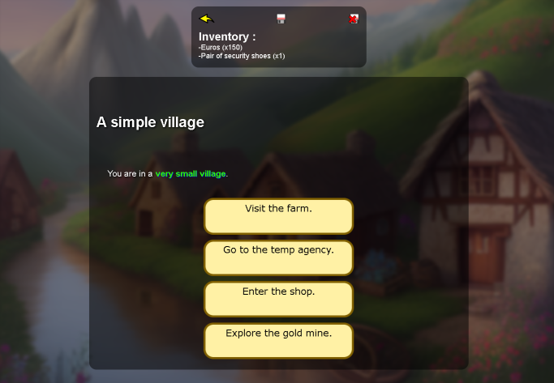

:toc:

== FRANCAIS ==
Un moteur de LDVELH.

Licence CC0 (sous respect de la loi française).

==== Fonctionnalités
* Sauvegarde/chargement.
* Inventaire.
* Redirections lors de seconde visite d'épisode (et gestion des redirections en boucle).
* Retour arrière (en ajustant l'inventaire de façon appropriée !).
* Garde-fous (détection des liens vers épisodes inexistants, détection des noms d'épisodes en doublon...).
* Javascript sans librairie.

==== Exemples

Jeu d'exemple servant de démo des fonctionnalités :
http://trotter.poulpe.gitlab.io/ldvelhjs/jeux/1_jeu_exemple/index.htm

Jeu sur lequel je bosse :
http://trotter.poulpe.gitlab.io/ldvelhjs/jeux/cyberpunk/index.htm

==== Fonctions de base

*creerEpisode* : fonction à utiliser pour écrire un nouvel épisode.

*titrerJeu* : donne un titre au jeu. Il sera utilisé lors de l'enregistrement des sauvegardes, pour differencier les sauvegardes d'un jeu d'un autre.

====== Commandes

Commandes utilisées dans les épisodes, exemple avec la fonction "ajouterInventaire" ci-dessous :
[source,javascript]
----
creerEpisode({
    clef: "allerInterim",
    titre : `Aller à l'agence d'interim.`,
    texte :`Vous travaillez avec l'agence et gagnez ***50 euros***.`
    ,commandes: () => {
		    ajouterInventaire({clef:"euros", nom:"Euros", description:"Des euros.", nombre:50});
    }
});
----

*ajouterInventaire* : `ajouterInventaire({clef:"idDeVotreObjet", nom:"Le nom de mon bel objet", description:"Ceci est mon bel objet.", nombre:99});` Ajouter ou retirer (en donnant un nombre négatif) un objet de l'inventaire.

*ajouterInventaireDiscretement* : `ajouterInventaireDiscretement({clef:"idDeVotreObjet", nom:"Le nom de mon bel objet", description:"Ceci est mon bel objet.", nombre:99});` : ajouter ou retirer (en donnant un nombre négatif) un objet de l'inventaire. Ne sera pas mis en valeur. Utile notamment pour donner quelque chose au joueur au début de l'aventure, ou de manière générale lorsqu'on ne veut pas attirer l'attention sur quelque chose qu'il reçoit.

*ajouterLien* : ``ajouterLien({libelle: `Nouveau lien.`, chemin: "cheminDuNouveauLien"});``. Ajouter un lien. Si un lien identique existe déjà, il ne sera pas ajouté.

*ajouterTexte* : ``ajouterTexte(`Nouveau texte !`);``. Ajoute un texte à la fin de l'épisode en cours ou d'un épisode spécifié.

*modifierVariable* : ``modifierVariable("nomDeMaVariable", 18);``. Donne une valeur à une nouvelle variable ou modifie une variable existant.

*nombrePossedeDe* : `nombrePossedeDe("pioche")`. Renvoie le nombre d'exemplaire de l'objet renseigné que possède le joueur. Utile pour metre des conditions en place, par exemple "si le joueur possède au moins 4 roues, alors...".

*nombreVisite* : retourne le nombre de visite précédentes de l'épisode en cours.

*remplacerLien* : ``remplacerLien({libelle: `Nouveau lien.`, chemin: "cheminDuNouveauLien"});``. Supprime tous les liens et remplace par d'autres.

*remplacerTexte* : ``remplacerTexte(`Nouveau texte !`);``. Remplace tout le texte de l'épisode en cours ou d'un épisode spécifié.

*valeurVariable* : ``valeurVariable("astuceFantomeDite")``. Retourne la valeur d'une variable.

== ENGLISH

A CYOA Javascript engine.

CC0 Licence under French law.

Have fun with it.

==== FEATURES
* Load/save system.
* Inventory.
* Redirect on already visited episode (and can manage circular redirects).
* Go backward (adjusting inventory accordingly !).
* Safeguards (detect duplicates, detect paths that leads nowhere...)
* Vanilla Javascript.

==== Examples

A sample game that serve as a demo of the features:
http://trotter.poulpe.gitlab.io/ldvelhjs/jeux/1_jeu_exemple/index.htm

Game I'm working on:
http://trotter.poulpe.gitlab.io/ldvelhjs/jeux/cyberpunk/index.htm
